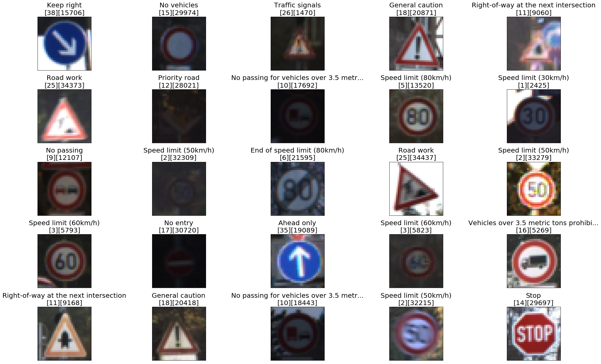
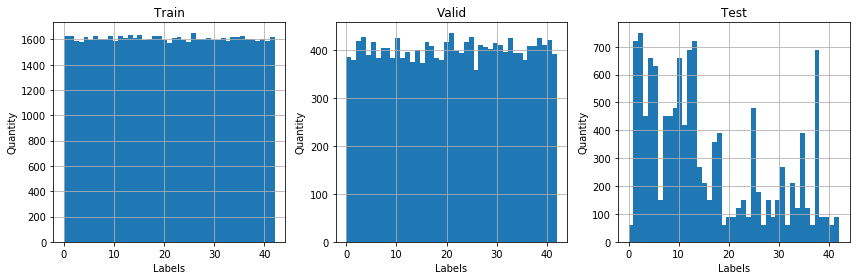

## Project: Build a Traffic Sign Recognition Program
[](http://www.udacity.com/drive)

Overview
---
In this project, you will use what you've learned about deep neural networks and convolutional neural networks to classify traffic signs. You will train and validate a model so it can classify traffic sign images using the [German Traffic Sign Dataset](http://benchmark.ini.rub.de/?section=gtsrb&subsection=dataset). After the model is trained, you will then try out your model on images of German traffic signs that you find on the web.

We have included an Ipython notebook that contains further instructions 
and starter code. Be sure to download the [Ipython notebook](https://github.com/udacity/CarND-Traffic-Sign-Classifier-Project/blob/master/Traffic_Sign_Classifier.ipynb). 

We also want you to create a detailed writeup of the project. Check out the [writeup template](https://github.com/udacity/CarND-Traffic-Sign-Classifier-Project/blob/master/writeup_template.md) for this project and use it as a starting point for creating your own writeup. The writeup can be either a markdown file or a pdf document.

To meet specifications, the project will require submitting three files: 
* the Ipython notebook with the code
* the code exported as an html file
* a writeup report either as a markdown or pdf file 

Creating a Great Writeup
---
A great writeup should include the [rubric points](https://review.udacity.com/#!/rubrics/481/view) as well as your description of how you addressed each point.  You should include a detailed description of the code used in each step (with line-number references and code snippets where necessary), and links to other supporting documents or external references.  You should include images in your writeup to demonstrate how your code works with examples.  

All that said, please be concise!  We're not looking for you to write a book here, just a brief description of how you passed each rubric point, and references to the relevant code :). 

You're not required to use markdown for your writeup.  If you use another method please just submit a pdf of your writeup.

The Project
---
The goals / steps of this project are the following:
* Load the data set
* Explore, summarize and visualize the data set
* Design, train and test a model architecture
* Use the model to make predictions on new images
* Analyze the softmax probabilities of the new images
* Summarize the results with a written report

### Dependencies
This lab requires:

* [CarND Term1 Starter Kit](https://github.com/udacity/CarND-Term1-Starter-Kit)

The lab environment can be created with CarND Term1 Starter Kit. Click [here](https://github.com/udacity/CarND-Term1-Starter-Kit/blob/master/README.md) for the details.

### Dataset and Repository

1. Download the data set. The classroom has a link to the data set in the "Project Instructions" content. This is a pickled dataset in which we've already resized the images to 32x32. It contains a training, validation and test set.
2. Clone the project, which contains the Ipython notebook and the writeup template.
```sh
git clone https://github.com/udacity/CarND-Traffic-Sign-Classifier-Project
cd CarND-Traffic-Sign-Classifier-Project
jupyter notebook Traffic_Sign_Classifier.ipynb
```

**Build a Traffic Sign Recognition Project**

### Dataset Exploration

#### Dataset Summary

I used the numpy library to calculate statistics of the traffic signs data set:

* Number of training examples = 34799
* Number of validation examples = 4410
* Number of testing examples = 12630
* Image data shape = (32, 32, 3)
* Number of classes = 43

#### Exploratory Visualization

Here is an exploratory visualization of the data set sample. 



And three bar chart diagrams show the distribution of the classes within the datasets.


### Design and Test a Model Architecture

#### Preprocessing 

The training and validation data sets had been populated to have a similar number of images per class.

Here is the tree bar chart diagrams show the distribution of the classes within the datasets.



Finally, the images were normalized using the mean and standard deviation of the images converted to gray scales.


Amount of data after increase

* Number of training examples = 69144
* Number of validation examples = 17286
* Number of testing examples = 12630

#### Model architecture

This model was composed of the following layers:

Input: 32x32x1 grayscale image

Convolution1 5x5: 1x1 pass, VALID filling, outputs 28X28X6

RELU

Dropout: Keep the probability = 0.7

Maximum pooling: 2x2 passes, requires 14x14x6

Convolution2 5x5: 1x1 passage, VALID filling, 10x10x16 outputs

RELU

Maximum pooling: 2x2 passes, requires 5x5x16

Dropout : Keep the probability = 0.7

Fully connected0 : Output = 400

Dropout : Keep the probability = 0.6

Fully connected1: Outbound = 120

RELU

Fully connected2: Outbound = 84

RELU

Dropout : Keep the probability = 0.6

Fully connected3 : Output = 43


#### Model Training

The same Lenet model of the tutorial was used, but with the addition of dropout in the convolution1 layers and in the fully connected layer, in addition to adjustments in the probability value.

The hiperparameters was updated to: 

Epochs = 75
Learning rate = 0.0009
batch size = 100

#### Solution Approach

The final model results are:
* Train Accuracy = #.###
* Valid Accuracy = #.###
* Test Accuracy  = #.###

The validation curve shows the accuracy of the validation in relation to the number of epochs:


### Test a Model on New Images

#### Acquiring New Images

Were used 8 German traffic signs from web.


#### Performance on New Images

The accuracy of the classification of the test images was #.###. 

#### Model Certainty - Softmax Probabilities
